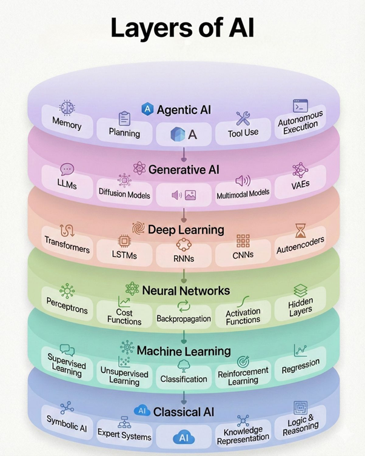
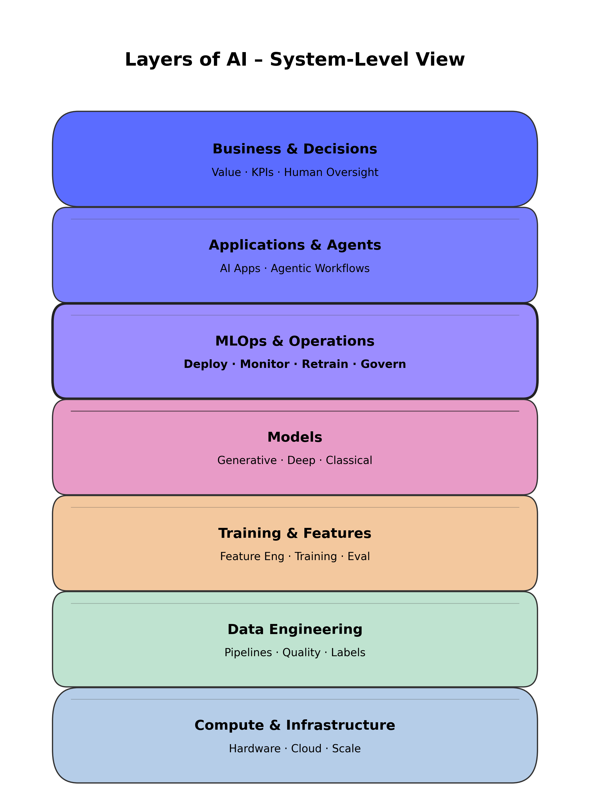

##AI Case Studies
- [From AI Taxonomy to Production-Grade Systems](ai-case-studies/README.md)

AI is often discussed in terms of models.
In practice, AI succeeds or fails as a system.

1️⃣ AI Taxonomy: What Exists

  

Purpose of this view

This diagram represents the conceptual and historical taxonomy of AI:

Classical AI → Machine Learning → Deep Learning

Generative AI → Agentic AI

It is useful for understanding:

What types of AI models and techniques exist

How modern approaches build on earlier foundations

📌 Limitation
This view does not explain how AI systems operate reliably in production.

2️⃣ AI as a System: How It Works in Reality

  

Purpose of this view

This diagram represents AI as an end-to-end engineered system, composed of layered responsibilities:

Compute & Infrastructure

Data Engineering

Training & Feature Engineering

Models

MLOps & Operations

Applications & Agents

Business & Decisions

This view answers a different question:

How does AI deliver value in real-world environments?

3️⃣ Connecting the Two Views

These diagrams describe two complementary axes:

View	Question it answers
AI Taxonomy	What kinds of AI exist?
System-Level Architecture	How does AI work in production?

Generative AI and Agentic AI define model capabilities.
MLOps, data pipelines, and governance define system reliability.

A powerful model without operations is a prototype.
A system with strong operations becomes infrastructure.

4️⃣ Why MLOps Is the Central Layer

In practice, most AI failures occur outside the model itself.

MLOps enables:

Reliable deployment and serving

Monitoring, drift detection, and retraining

Versioning, traceability, and governance

Trustworthy integration into business workflows

Without MLOps, AI remains a demo.
With MLOps, AI becomes a system.

5️⃣ Key Takeaway

AI maturity is not defined by model sophistication,
but by how well the surrounding system is engineered.

This case study reflects my approach to AI:
from taxonomy → to architecture → to production systems.

📌 Optional: Interview-Ready Summary

“Many AI diagrams explain models.
I focus on how models become reliable, scalable systems.
That transition happens in MLOps.”

📁 Suggested Repository Structure
/ai-case-studies
  ├── README.md
  └── images
      ├── layers_of_ai_taxonomy.png
      └── layers_of_ai_rounded_mlops_emphasis.png

🧠 Why is this layout powerful?

Case Study

Production-Grade AI in Semiconductor Manufacturing:
Why MLOps Was the Decisive Factor
Project Context

This project focused on deploying AI within a semiconductor manufacturing environment, where requirements around yield, reliability, traceability, and sign-off credibility are significantly higher than in typical software-driven AI use cases.

The objective was not experimental modeling, but supporting production decisions in areas such as process control, inspection analysis, and manufacturing readiness.
In this environment, AI failure modes directly translate into cost, yield loss, or qualification risk.

Layer-by-Layer System Mapping
1️⃣ Compute & Infrastructure

The AI system was deployed on fab-compatible infrastructure, balancing compute availability with security and latency constraints.
Inference workloads were optimized for predictable response times to align with manufacturing takt time requirements.
Infrastructure stability was a prerequisite for any production use.

2️⃣ Data Engineering

Manufacturing data originated from heterogeneous sources including inspection tools, metrology systems, and process logs.
Robust data pipelines were required to handle versioned data, schema evolution, and tool configuration changes.
Strict data quality controls were essential, as minor upstream variations could invalidate downstream analysis.

3️⃣ Training & Feature Engineering

Feature engineering focused on process-relevant representations rather than generic statistical features.
Training workflows were standardized and repeatable to support traceability and auditability.
Evaluation emphasized stability and consistency over incremental accuracy improvements.

4️⃣ Models

The project employed machine learning and deep learning models suitable for manufacturing data characteristics.
Model choices prioritized robustness, explainability, and operational confidence rather than maximum complexity.
In this context, the model was deliberately treated as replaceable, not central.

5️⃣ ⭐ MLOps & Operations (Critical Layer)

MLOps was the enabling layer that allowed AI to operate in a manufacturing-grade environment.
Deployment pipelines, monitoring, drift detection, and controlled retraining ensured that models remained valid as processes evolved.
This layer provided traceability, version control, and sign-off confidence, which are mandatory in semiconductor production.

Without MLOps, the system could not meet manufacturing or quality requirements.

6️⃣ Applications & Agents

AI outputs were integrated into workflows supporting engineers and manufacturing teams.
Automation was intentionally constrained, with clear decision boundaries and escalation paths.
Human-in-the-loop mechanisms ensured accountability and preserved engineering trust.

7️⃣ Business & Decisions

The system supported decisions impacting yield, risk mitigation, and manufacturing readiness.
Success was measured by operational adoption, decision confidence, and sustained reliability—not by model metrics alone.
AI became a trusted tool rather than an experimental technology.

Why MLOps Was Essential in Manufacturing AI

In semiconductor manufacturing:

Data distributions change with tools, recipes, and process nodes

Silent model degradation is unacceptable

Traceability and rollback are non-negotiable

MLOps enabled:

Controlled deployment aligned with fab change management

Continuous monitoring for drift and anomalies

Safe retraining without disrupting production flows

MLOps was the boundary between AI experimentation and production sign-off.

Key Takeaway

In semiconductor manufacturing, AI maturity is defined by operational trust, not model novelty.

This project demonstrated that production-grade MLOps is the prerequisite for deploying AI in high-risk manufacturing environments.

Interview-Ready Summary (Manufacturing-Focused)

“In semiconductor manufacturing, the challenge isn’t building AI models—it’s making them trustworthy.
MLOps provides the traceability, monitoring, and control required for production sign-off.”

Optional: Where This Fits in the AI Layers

AI Taxonomy View: ML / DL models applied to manufacturing data

System View: End-to-end pipeline with MLOps as the central stabilizing layer

Concrete Examples from Semiconductor Manufacturing
Example 1: Inspection Drift Detection

Problem
In inline inspection, gradual changes in tool behavior and process conditions caused distribution drift in inspection data.
While models initially performed well, subtle drift accumulated over time, leading to increased false positives and reduced engineering trust.

MLOps Response

Continuous monitoring was implemented to track feature distributions and output stability

Drift thresholds were defined in collaboration with process engineers

Alerts triggered controlled evaluation before production impact occurred

Outcome
The system detected drift before yield impact, enabling timely retraining and maintaining confidence in inspection results.

Without monitoring and retraining, model degradation would have gone unnoticed until it affected yield decisions.

Example 2: Tool Change and Configuration Updates

Problem
Tool maintenance events and configuration changes introduced non-obvious shifts in data characteristics.
From a modeling perspective, these changes appeared as unexplained performance drops.

MLOps Response

Tool configuration metadata was versioned alongside model and data artifacts

Deployment pipelines enforced compatibility checks between tool state and model versions

Rollback mechanisms ensured safe recovery in case of unexpected behavior

Outcome
AI outputs remained interpretable and traceable across tool changes, supporting stable operation during maintenance cycles.

MLOps ensured that operational changes did not silently invalidate AI results.

Example 3: Process Node Migration

Problem
During process node transitions, historical training data became only partially representative of new conditions.
Direct model reuse risked incorrect recommendations during early production phases.

MLOps Response

Training pipelines supported phased retraining with mixed historical and early-node data

Model versions were explicitly tied to process node context

Human-in-the-loop validation was enforced during ramp-up

Outcome
The AI system adapted safely to new process nodes while preserving engineering oversight and decision confidence.

Model evolution was controlled, auditable, and aligned with manufacturing ramp strategy.

What These Examples Demonstrate

Across inspection drift, tool changes, and node migration, the model itself was never the primary failure point.
Instead, risk emerged from unmanaged change.

MLOps provided:

Early visibility into system degradation

Traceability across data, tools, and models

Safe adaptation to evolving manufacturing conditions

In semiconductor manufacturing, AI must evolve at the same pace as the process—without breaking trust.

Reinforced Key Takeaway

MLOps is not a support function.
It is the control layer that makes AI acceptable in production fabs.

Interview-Ready Closing (with examples)

“We saw issues like inspection drift, tool changes, and process node migration.
None of these were model problems—they were system change problems.
MLOps gave us the control and traceability needed to keep AI usable in production.”

