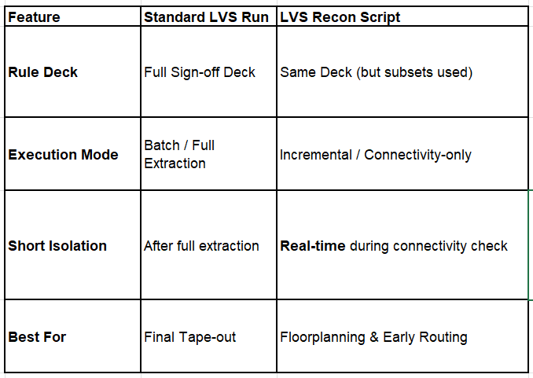

1. Calibre LVS Recon	
    
Calibre LVS Recon is designed for early-stage circuit verification, focusing on finding major connectivity issues without running a full, time-consuming LVS.	
    
Category	Description
Purpose	To rapidly detect "showstopper" connectivity errors (Shorts, Opens, Isolated Nets) in dirty or incomplete layouts.
Usage	Executed using the calibre -lvs -recon command. It often targets specific high-priority nets like VDD/VSS.
Key Advantages	1. Speed: 5x to 10x faster than a full LVS run.
    
    2. Selective Check: Allows verification of specific layers or nets (e.g., checking only top-level metal shorts).
    
    3. Memory Efficiency: Uses significantly less RAM by skipping complex device parameter extraction.
Use Case	Identifying a VDD-GND short in a multi-million gate design before the layout is finalized.

2. Calibre DRC Recon	
    
Calibre DRC Recon is a high-speed physical verification tool that filters through thousands of rules to find the most "dominant" or systematic violations.	
    
Category	Description
Purpose	To perform a "sanity check" on immature layouts, focusing on high-impact violations rather than every minor spacing error.
Usage	Executed via calibre -drc -recon. Users can use "Check Recipes" to select specific rule subsets (e.g., Base-layer only or Metal-layer only).
Key Advantages	1. Error Pruning: Automatically hides redundant errors, showing only the root cause of systematic violations.
    
    2. Faster Iteration: Shortens the debug cycle by providing results in minutes instead of hours.
    
    3. Step-by-Step Verification: Enables a "Build-and-Verify" flow where designers check blocks as they are placed.
Use Case	Checking wide-metal spacing and density rules in a large SOC floorplan during the early routing phase.

3. Comparison Summary: Recon vs. Standard Full-Run		
        
Feature	Recon Mode (-recon)	Standard Full-Run
Design Stage	Early / In-progress	Final / Tape-out Sign-off
Verification Depth	Major connectivity & Dominant DRC	100% Rule Compliance & Parameter Extraction
Turn-Around Time	Minutes to an Hour	Several Hours to Days
Goal	Debug Productivity (Fast Fixes)	Sign-off Quality (Zero Errors)
        
        
💡 Interview Talking Points (English)		
        
If the interviewer at Infineon asks about your experience with advanced verification flows, you can say:		
        
"I utilize Calibre LVS Recon during the early integration phase to isolate power-ground shorts quickly. This prevents the 'noise' of thousands of secondary errors from hiding the critical connectivity issues."		
        
"By using DRC Recon, I can execute a targeted verification of critical layers. This reduced our total verification TAT (Turn-Around Time) by roughly 50%, as we didn't have to wait for a full-chip sign-out run to fix systematic layout issues."		
        
"Combined with Calibre Query Server, I can automate the extraction of Recon-identified short coordinates and highlight them directly in Virtuoso using SKILL scripts for immediate fixing."		

1. Calibre LVS Recon Control Script (run_recon.tcl)
This script configures the Recon engine to perform a Short Isolation check on critical nets (like VDD and VSS), which is the most common use case in industry.

Tcl

# =================================================================
# Calibre LVS Recon Configuration Script
# Usage: calibre -lvs -recon -recon_user_file run_recon.tcl rules_file
# =================================================================

# 1. Define the Verification Focus
# Options: ALL (default), SHORTS, OPENS, ISOLATED_NETS
LVS RECON SELECT SHORTS

# 2. Specify Target Nets (High Priority)
# Focusing on Power and Ground usually reveals 90% of early integration issues
LVS RECON NETS "VDD?" "VSS?" "GND?" "DVDD" "DVSS"

# 3. Set Search Depth and Hierarchy
# This limits the search to speed up the process on large SoCs
LVS RECON DEPTH PRIMARY
LVS RECON HIERARCHY YES

# 4. Filter Layers (Optional)
# If you only want to check Top Metal layers where most shorts occur
# LVS RECON LAYERS M7 M8 M9 AP

# 5. Output Configuration
# Defines where the quick-view results (SVDB) will be stored for RVE
LVS RECON REPORT "lvs_recon.rep"
LVS RECON MASK SVDB DIRECTORY "svdb_recon" QUERY

2. How to Execute the Session
From your Linux terminal, you would run the following command to trigger the Recon engine using the script above:
Bash runme.exe:

# -lvs: Run LVS module
# -recon: Enable Reconnaissance mode (high speed)
# -recon_user_file: Path to the Tcl script above
calibre -lvs -recon -recon_user_file run_recon.tcl ./lvs_rules_file

3. Key Advantages of this Script
When presenting this to an interviewer at IFX, emphasize these three points:

Targeted Debugging: "By using the LVS RECON NETS command, I prioritize power-grid integrity. This avoids wasting CPU cycles on signal nets before the power infrastructure is proven clean."

SVDB Generation: "The script generates a Query-ready SVDB. This allows me to immediately open the results in Calibre RVE or pull coordinates into Virtuoso via the Query Server for automated highlighting."

Early Detection: "I can run this script on a 'dirty' layout where standard LVS would take 10+ hours to finish or crash due to too many errors. Recon gives me the 'Short' locations in under 30 minutes."

4. Comparison Table: Full LVS vs. Recon Script		
        

# 특정 체크 세트(Recipe)를 지정하여 실행
calibre -drc -recon -recon_recipe "All_Base_Layers" rules.drc
#Check Recipe 기능을 통해 베이스 레이어와 파워 메시(Power Mesh)의 치명적인 에러를 우선적으로 수정함으로써, 최종 Sign-off DRC 시간을 크게 단축할 수 있었습니다."

# 규칙 파일 내 삽입 또는 컨트롤 파일로 로드
DRC RECON SELECT "METAL1_SPACING" "METAL2_WIDTH"

레시피 이름 (예시)	검증 대상 및 용도
All_Base_Layers	    FEOL(Front-End) 공정. NWEL, DIFF, POLY 등 소자 구조 관련 핵심 룰 검사.
All_Metal_Layers	BEOL(Back-End) 공정. Metal 1부터 최상위 Metal까지의 Spacing, Width 검사.
All_Via_Layers	    Via 및 Contact의 Enclosure, 정렬(Alignment) 룰 위주로 검사.
Critical_Checks	    공정상 가장 치명적인(Yield에 직결되는) 핵심 룰들만 모아서 초고속 검사.
Antenna_Checks	 제조 공정 중 Gate 산화막 파괴를 방지하기 위한 안테나 룰만 따로 검사.
Density_Checks	 Metal Fill을 넣기 전, 각 레이어의 점유율(Density)이 하한선을 넘는지 검사.

Tcl

# DRC 룰 파일 내부 예시
GROUP "My_Top_Metals" METAL7 METAL8 METAL9
위와 같이 정의되어 있다면 명령어는 다음과 같습니다: calibre -drc -recon -recon_recipe "My_Top_Metals" rules.drc