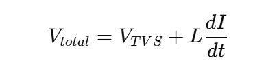
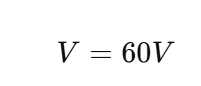
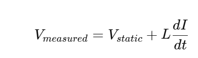
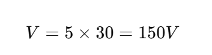

L effect on TVS diode?

좋습니다 👍
이제 TVS 다이오드에서 Parasitic Inductance (L)의 영향을 정확히 정리해 보겠습니다.

🔷 1️⃣ 핵심 식

TVS 앞/뒤에 기생 인덕턴스가 존재하면:

Vtotal
	​

=V
TVS
	​

+L
dt
dI
	​

TVS가 아무리 낮은 클램프 전압을 가져도
L·dI/dt 전압이 추가됩니다.

🔷 2️⃣ 왜 TVS에서 특히 중요할까?

ESD / IEC 이벤트 특징:

Rise time ≈ 1 ns

dI/dt 매우 큼 (10~30 A/ns 가능)

예시:

L = 3 nH

dI/dt = 20 A/ns

V=60V

TVS 정적 클램프가 20V여도
라인에서는 80V까지 상승 가능

🔷 3️⃣ TVS 동작 과정에서의 영향
(1) Initial Overshoot

TVS가 avalanche에 들어가기 전,
인덕턴스가 먼저 전압을 생성

→ Peak voltage 상승
→ 보호 실패 가능

(2) Dynamic Clamping 상승

TLP에서는 낮은 clamp 전압
IEC에서는 더 높게 측정됨

원인:

Vmeasured
	​

=V
static
	​

+L 
dt
dI
	​

(3) Snapback 구조에서 더 심각

Snapback TVS는:

Trigger voltage (Vt1)

Holding voltage (Vh)

L이 크면:

Trigger 지연

NDR + L → ringing 가능

불안정성 증가

(4) Ground Bounce

공통 GND 인덕턴스가 크면:

기준 전압이 흔들림

클램프 정확도 감소

Kelvin grounding이 중요한 이유

🔷 4️⃣ 위치에 따른 영향
📌 (A) TVS 앞쪽 인덕턴스
Connector ── L ── TVS ── GND

→ TVS가 빨리 동작해도
라인 전압은 L 때문에 상승

📌 (B) GND 쪽 인덕턴스
TVS ── L ── GND

→ 전류가 GND로 빠질 때
L이 전압 상승 유발

→ Clamp 전압 증가

🔷 5️⃣ 수치 예제

IEC 8kV:

Peak current ≈ 30A

Rise time ≈ 1ns

Assume:

L_total = 5 nH

V=5×30=150V

이건 실제 시스템에서 충분히 발생 가능

🔷 6️⃣ 설계 대응 전략

✔ TVS를 커넥터 바로 옆 배치
✔ GND via 여러 개 사용
✔ Loop area 최소화
✔ Kelvin ground
✔ Flip-chip 패키지 사용
✔ Wide copper plane

🔷 7️⃣ Avalanche TVS vs Snapback TVS
항목	Avalanche TVS	Snapback TVS
L 영향	Overshoot 증가	더 민감
안정성	비교적 안정	NDR로 인해 불안정 가능
Trigger 지연	영향 적음	영향 큼
🎯 핵심 정리

Parasitic inductance limits the real-world performance of a TVS diode by adding dynamic overshoot voltage proportional to current slew rate.

🔥 한 줄 결론

TVS 성능은 Vclamp만으로 결정되지 않는다.
L·dI/dt가 실제 보호 성능을 좌우한다.